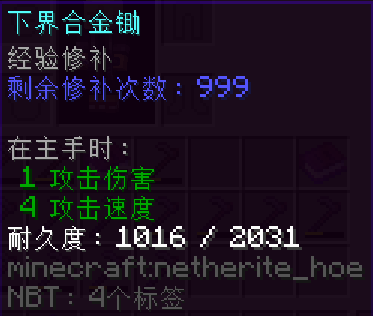

Slow Mending -- A Bukkit server plugin
===

Slow Mending is a manage plugin,that allows operators restrict the experience mend of tools. It can let the mend slower,and can restrict the mend amount of any tools.And it also alows player use "Expansion Cards" to add the amount. 

Features
--
* Easy to use
* Support all type of tool(can be mended)
* Display amount in item lore
* Item can edit by command

Releases
--
Github projects have a "releases" link on their home page. If you still don't see it,
[click here](https://github.com/super-boy-520/slow-mending-re/releases)
for Slow Mending release.

